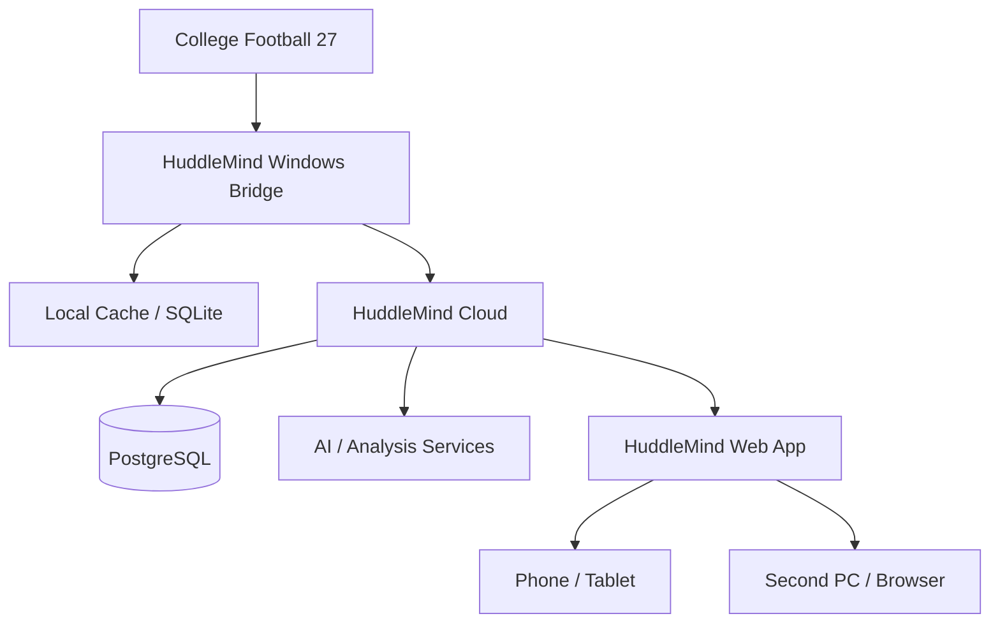

# HuddleMind Architecture

**Status:** Initial architecture  
**Last Updated:** 2026-09-16

This document describes the starting architecture for HuddleMind. It is intentionally simple and will evolve as we learn more about College Football 27's actual data and behavior.

## 1. System Overview

HuddleMind is split into a local Windows bridge and a web-first cloud experience.



### Gaming PC

Runs College Football 27 and the HuddleMind Windows bridge.

The bridge will eventually:

- Locate dynasty saves/data.
- Detect meaningful changes.
- Parse or consume parsed dynasty information.
- Convert CFB27-specific information into HuddleMind models.
- Maintain local history/cache.
- Observe live games through screen capture/computer vision when needed.
- Run low-latency recommendation logic.
- Send normalized events to the cloud.

### Cloud

Stores HuddleMind-owned program history and distributes realtime updates to the web application.

Expected responsibilities:

- Authentication
- Dynasty ownership
- PostgreSQL persistence
- Realtime events
- Recommendation history
- AI orchestration
- Bridge authentication

Supabase is the initial managed-backend candidate, but HuddleMind should avoid coupling core domain logic tightly to a single provider.

### Web App

The web app is the main HuddleMind interface.

Initial target:

- Next.js
- TypeScript
- Responsive/mobile-first UI
- Tailwind CSS

It should work from a phone or another computer without requiring access to the local CFB27 filesystem.

---

## 2. Data Flow

### Dynasty update

```text
CFB27 save/data changes
        ↓
Bridge detects change
        ↓
Bridge reads/parses source
        ↓
CFB27-specific adapter
        ↓
HuddleMind normalized models
        ↓
Local history/cache
        ↓
Normalized events sent to cloud
        ↓
Database updated
        ↓
Web app receives update
        ↓
Recommendations recalculated where needed
```

### Live game update

```text
CFB27 game window
        ↓
Screen capture
        ↓
Region detection / OCR / CV
        ↓
Observed game state + confidence
        ↓
State confirmation
        ↓
Fast recommendation engine
        ↓
Live event sent to web dashboard
```

---

## 3. Architecture Principles

### 3.1 Read-first CFB27 integration

HuddleMind starts by observing rather than modifying the game.

Order of preference:

1. Read local supported data.
2. Watch files for changes.
3. Observe game visuals.
4. Build HuddleMind's own history.
5. Consider deeper integration only when a proven product requirement cannot be met otherwise.

Original dynasty saves must not be modified as part of normal HuddleMind operation.

### 3.2 Normalize at the bridge boundary

CFB27-specific structures should stop at an adapter boundary.

```text
CFB27 representation
        ↓
CFB27 adapter
        ↓
HuddleMind representation
```

This prevents game-specific table names, parser quirks, or save-format details from leaking throughout the web app and recommendation engine.

### 3.3 Fast brain and deep brain

#### Fast brain

Used for time-sensitive decisions such as live play recommendations.

Characteristics:

- Local or low latency
- Deterministic/statistical first
- Easy to measure
- Explainable factors
- Does not require an LLM request to function

Examples:

- Down/distance fit
- Clock strategy
- Field-position fit
- User historical success
- Opponent tendency
- Predictability penalty

#### Deep brain

Used for analysis where a few seconds of latency is acceptable.

Examples:

- Weekly staff report
- Recruiting strategy
- Roster planning
- Opponent scouting summary
- Natural-language explanations
- Conversational questions

### 3.4 Preserve observations over time

Do not treat every new save parse as a replacement for all historical data.

HuddleMind should preserve observations so it can answer questions the current CFB27 save alone may not answer later.

Examples:

- Recruiting movement by week
- Player-development changes
- Historical depth
- Recommendation outcomes
- Play tendencies
- Past season comparisons

### 3.5 Confidence matters

Computer-vision-derived game state may be wrong.

Live observations should eventually carry confidence and should be confirmed across multiple frames before HuddleMind treats them as authoritative when practical.

---

## 4. Initial Repository Layout

```text
HuddleMind/
├── bridge/
│   └── README.md
├── web/
│   └── README.md
├── docs/
│   ├── ARCHITECTURE.md
│   └── DEVELOPMENT.md
├── PRD.md
├── PROJECT_PROGRESS.md
├── .gitignore
└── README.md
```

We are intentionally not creating a deep source tree before the first feature requires it.

Expected later shape may include:

```text
bridge/
├── src/
├── tests/
└── ...

web/
├── app/
├── components/
└── ...
```

Those directories should be introduced by real work rather than speculation.

---

## 5. Initial Technology Decisions

### Windows bridge

- Python **3.12**
- Standard `venv`
- `pip`
- `pathlib` for filesystem work
- SQLite later for local persistence
- `watchdog` later for save watching
- Pydantic later for validated data models
- OpenCV later for live game observation

### Web

Planned starting point:

- Next.js
- TypeScript
- Tailwind CSS

The web project is not initialized during Milestone 0 because the first product risk is proving the local CFB27 bridge.

### Cloud

Initial candidate:

- PostgreSQL
- Supabase authentication/realtime/database services

Provider-specific implementation should wait until local source data can be reliably normalized.

---

## 6. First Vertical Slice

The first vertical slice is deliberately tiny:

```text
Python bridge starts
        ↓
Find Windows home directory
        ↓
Inspect expected/local CFB27 locations
        ↓
Identify save directory
        ↓
List candidate dynasty files
```

This does **not** require:

- Cloud hosting
- AI
- Next.js
- Computer vision
- Save modification
- Database design

That keeps our first lesson focused on Python fundamentals and verifies the first real-world assumption: where the dynasty data actually lives.

---

## 7. Open Architecture Questions

These remain intentionally unresolved until we gather evidence:

- Exact CFB27 save naming/location behavior on the user's PC
- Which community parser, if any, should become the initial source adapter
- Which entities are reliably available from current saves
- Recruiting/staff/facility completeness
- How playbook data should be extracted and normalized
- Best method for live scoreboard recognition across resolutions/UI scales
- Whether a local FastAPI service is useful or unnecessary
- Exact Supabase/backend division of responsibility

These questions are tracked in `PROJECT_PROGRESS.md`.
